# MachineLearningData
This is a data visualization and human-computer interaction experiment code section. Here we process data for sun's three products, each with fifteen thousand data.
Each dataset contains customer reviews, ratings for products and some other information. 
For the review, we used natural language processing in machine learning to implement text sentiment analysis, two RTX3090 graphics cards to train the model,
the model was saved in a model1 file, and also used the time data prediction method to predict the reputation of the product (defined by the formula given by the literature reference) to predict the data after the year. 
Finally, a gray correlation analysis is used to process the degree of association between the review text and the star rating.

# C: A Wealth of Data

## Problem:

在它创建的在线市场中，亚马逊为客户提供了一个对购买进行评级和评论的机会。个人评级——称为“星级评级”——允许购买者用1(低评级，低满意度)到5(高评级，高满意度)的等级来表达他们对产品的满意程度。此外，客户可以提交基于文本的信息——称为“评论”——以表达对产品的进一步意见和信息。其他客户可以对这些评论进行有帮助或无帮助的评级——称为“有帮助评级”——以帮助他们自己的产品购买决策。公司利用这些数据来洞察他们所参与的市场、参与的时间，以及产品设计特征选择的潜在成功。

阳光公司计划在网上市场推出并销售三种新产品:微波炉、婴儿奶嘴和吹风机。他们聘请你的团队作为顾问，以确定关键模式，关系，措施和参数，在过去的客户提供的评级和评论与其他竞争产品，以1)通知他们的在线销售战略和2)确定潜在的重要设计特征，将提高产品的可取性。阳光公司过去曾使用数据来指导销售策略，但他们以前从未使用过这种特殊的数据组合和类型。阳光公司特别感兴趣的是这些数据中基于时间的模式，以及它们是否以有助于公司制作成功产品的方式相互作用。

为了帮助您，Sunshine的数据中心为您提供了吹风机这个项目的三个数据文件。tsv,微波炉。tsv,  pacifier.tsv。这些数据代表了在数据显示的时间段内亚马逊市场上销售的微波炉、婴儿奶嘴和吹风机的客户提供的评级和评论。还提供了数据标签定义的词汇表。提供的数据文件包含您应该用于此问题的唯一数据。

## Requirements：

1. 分析提供的三种产品数据集，以识别、描述和支持数学证据、有意义的定量和/或定性模式、关系、度量，以及星级评级、评论、以及帮助评级，这将帮助阳光公司在他们的三个新的在线市场产品上取得成功。
2. 请用您的分析来解决阳光公司营销总监提出的以下具体问题和要求:
   1. 一旦他们的三种产品在在线市场上销售，确定基于评级和评论的数据度量，这对阳光公司的跟踪是最有信息量的。
   2. 确定并讨论每个数据集中基于时间的度量和模式，这些度量和模式可能表明产品的声誉在在线市场上是上升还是下降。
   3. 确定基于文本的度量和基于评级的度量的组合，以最好地指出潜在的成功或失败的产品。
   4. 特定的星级评级是否会引发更多的评论?例如，用户是否更有可能在看到一系列低星级评级后写一些评论?
   5. 基于文本的评论的特定质量描述符，如“热情”、“失望”等，是否与评级水平密切相关?
3. 写一封一到两页的信给阳光公司的市场总监，总结你们团队的分析和结果。包括你的团队最自信地向市场总监推荐的结果的具体理由。

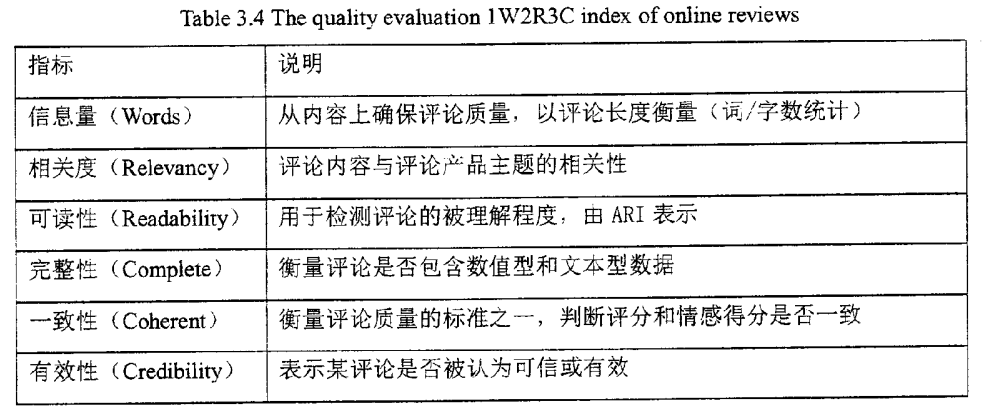

https://d.wanfangdata.com.cn/thesis/ChJUaGVzaXNOZXdTMjAyMTEyMDESCFkzMjcxNDQyGgh4cHJkeXNzcQ%3D%3D

情感分析模型（LSTM+RNN）

1. 数据集数据来源http://qwone.com/~jason/20Newsgroups/

   1. 训练集labeledTrainData.tsv(24500条带标签的训练数据)

      id sentiment review 表示文本唯一确认id，情感色彩类别标签，待分析的文本数据

      如下

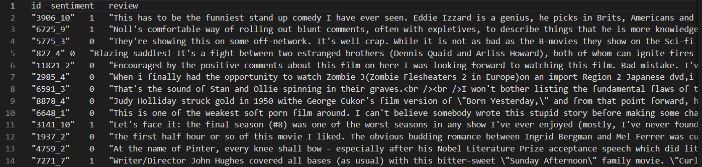

2. 测试集（testData.tsv：22000条无标签测试数据）

   id 表示文本唯一确认id， review，评论的主体文本数据

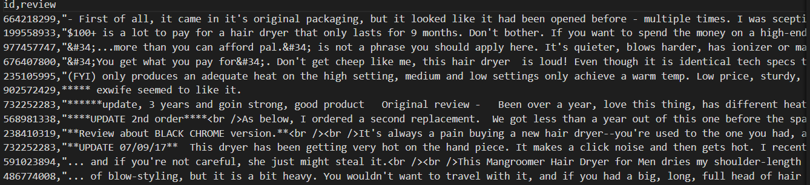

2. 基础模型

词向量模型：

由于计算机只认识二进制数字，所以我们映入了词向量模型来解决这个问题。

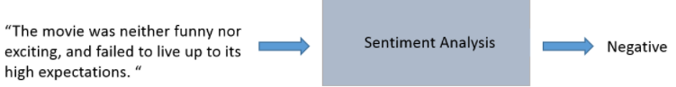

我们可以将一句话中的每一个词都转换成一个向量。

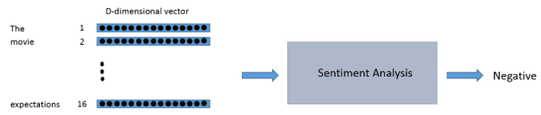

词向量是具有空间意义的并不是简单的映射！

例如，我们希望单词 “love” 和 “adore” 这两个词在向量空间中是有一定的相关性的，因为他们有类似的定义，他们都在类似的上下文中使用。单词的向量表示也被称之为词嵌入。

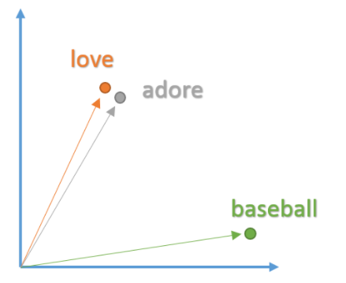

为了去得到这些词嵌入，我们使用一个非常牛逼的模型 “Word2Vec”。简单的说，这个模型根据上下文的语境来推断出每个词的词向量。

Word2Vec 模型根据数据集中的每个句子进行训练，并且以一个固定窗口在句子上进行滑动，根据句子的上下文来预测固定窗口中间那个词的向量。然后根据一个损失函数和优化方法，来对这个模型进行训练。（在文中在我们使用了了谷歌已经训练好的词向量wordList.npy

现在，我们已经得到了神经网络的输入数据 —— 词向量，接下来让我们看看需要构建的神经网络。NLP 数据的一个独特之处是它是时间序列数据。每个单词的出现都依赖于它的前一个单词和后一个单词。由于这种依赖的存在，我们使用循环神经网络来处理这种时间序列数据。

RNN网络结构

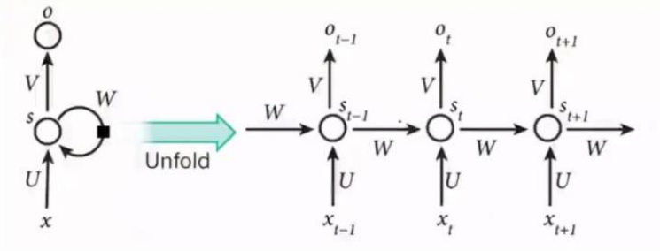

对于基本RNN来说，它能够处理一定的短期依赖，但无法处理长期依赖问题。 当句子比较长，RNN就无法处理这种问题。因为当序列较长时，序列后部的梯度 很难反向传播到前面的序列，这就产生了梯度消失问题。当然，RNN也存在梯度 爆炸问题。

隐藏状态是当前单词向量和前一步的隐藏状态向量的函数。并且这两项之和需要通过激活函数来进行激活。

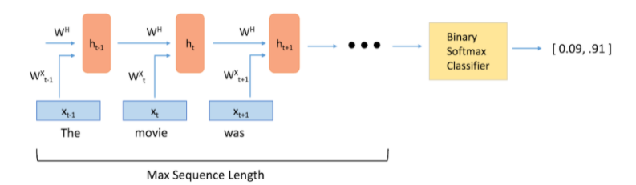

对于基本RNN来说，它能够处理一定的短期依赖，但无法处理长期依赖问题。 当句子比较长，RNN就无法处理这种问题。因为当序列较长时，序列后部的梯度 很难反向传播到前面的序列，这就产生了梯度消失问题。当然，RNN也存在梯度爆炸问题。

RNN本时刻的隐藏层信息只来源于当前输入和上一时刻的隐藏层信息，没有 记忆功能。为了解决RNN的长期依赖也即梯度消失问题，LSTM应运而生。LSTM 的网络结构图如下：

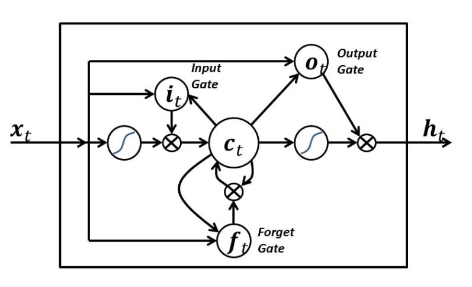

该单元根据输入数据 x(t) ，隐藏层输出 h(t) 。在这些单元中，h(t) 的表达形式比经典的 RNN 网络会复杂很多。这些复杂组件分为四个部分：输入门，输出门，遗忘门和一个记忆控制器。每个门都将 x(t) 和 h(t-1) 作为输入（没有在图中显示出来），并且利用这些输入来计算一些中间状态。每个中间状态都会被送入不同的管道，并且这些信息最终会汇集到 h(t) 。

词频率：

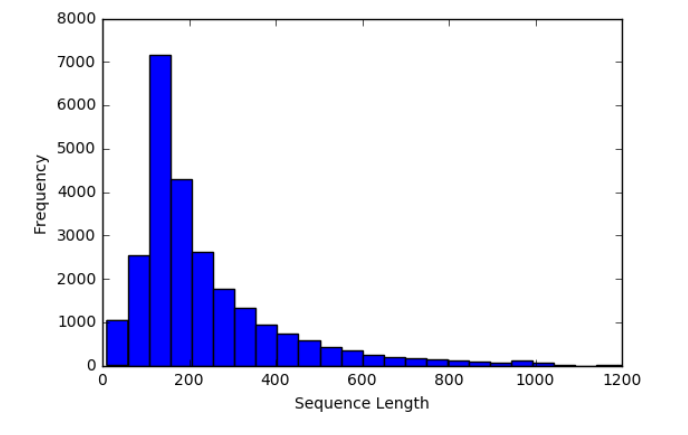

参数调整：

选择合适的超参数来训练你的神经网络是至关重要的。你会发现你的训练损失值与你选择的优化器（Adam，Adadelta，SGD，等等），学习率和网络架构都有很大的关系。特别是在RNN和LSTM中，单元数量和词向量的大小都是重要因素。

- 学习率：RNN最难的一点就是它的训练非常困难，因为时间步骤很长。那么，学习率就变得非常重要了。如果我们将学习率设置的很大，那么学习曲线就会波动性很大，如果我们将学习率设置的很小，那么训练过程就会非常缓慢。根据经验，将学习率默认设置为 0.001 是一个比较好的开始。如果训练的非常缓慢，那么你可以适当的增大这个值，如果训练过程非常的不稳定，那么你可以适当的减小这个值。

- 优化器：这个在研究中没有一个一致的选择，但是 Adam 优化器被广泛的使用。

- LSTM单元的数量：这个值很大程度上取决于输入文本的平均长度。而更多的单元数量可以帮助模型存储更多的文本信息，当然模型的训练时间就会增加很多，并且计算成本会非常昂贵。

- 词向量维度：词向量的维度一般我们设置为50到300。维度越多意味着可以存储更多的单词信息，但是你需要付出的是更昂贵的计算成本。

  训练图片：

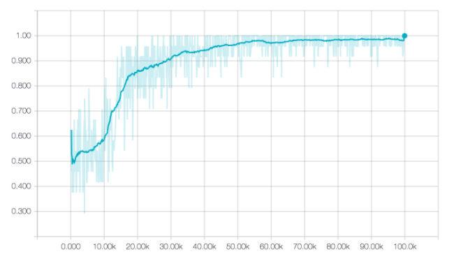

## Prophet（时序数据预测）参考https://zhuanlan.zhihu.com/p/52330017和https://peerj.com/preprints/3190/

Prophet算法实现：

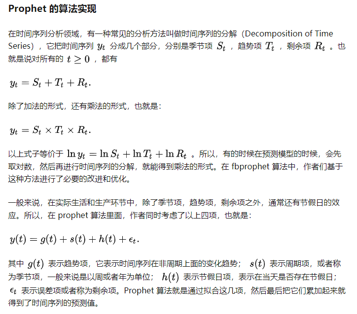

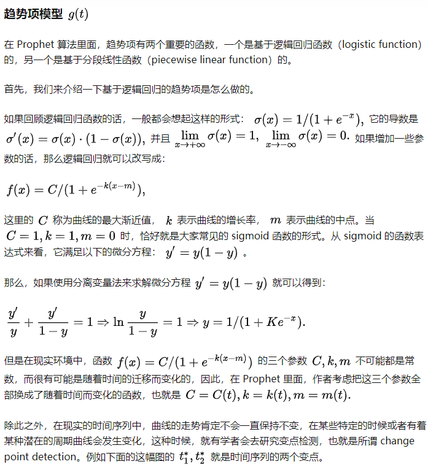

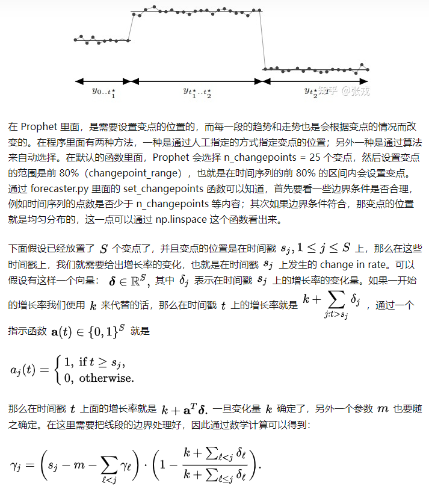

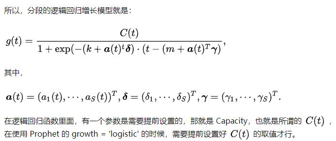

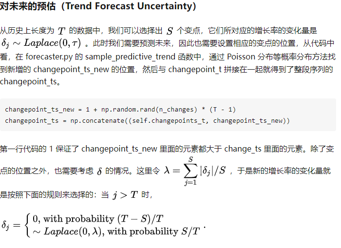

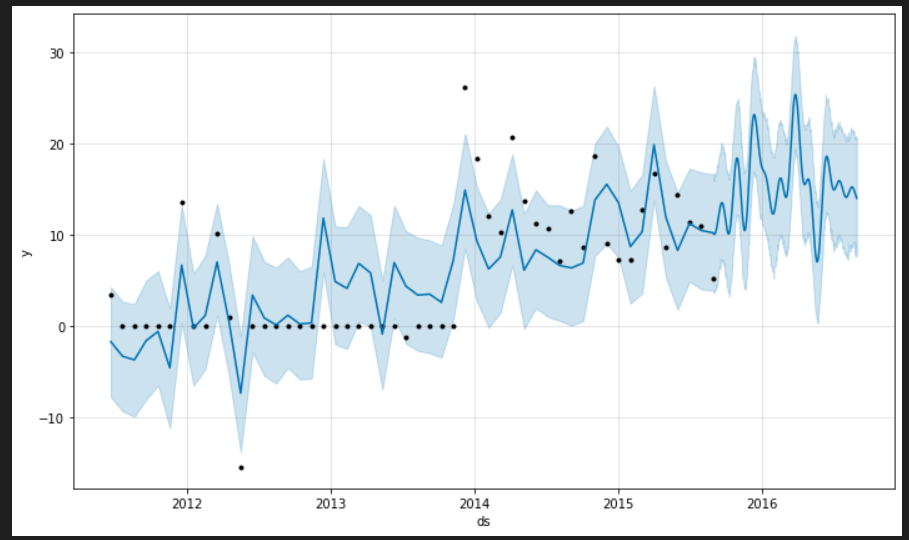

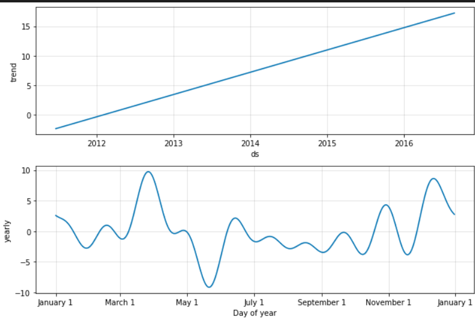

## 灰色关联分析

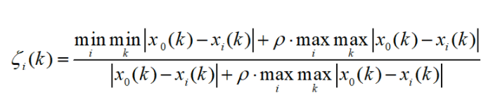

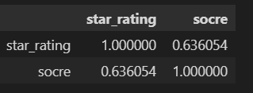

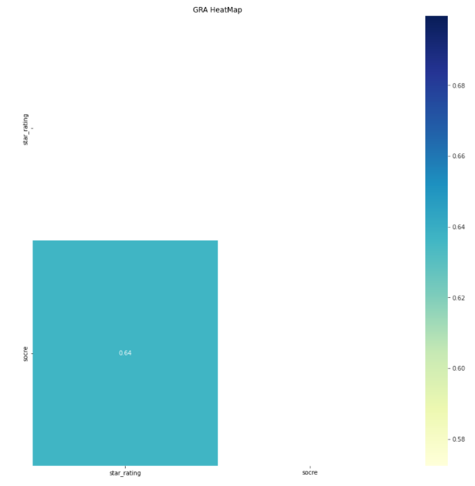

